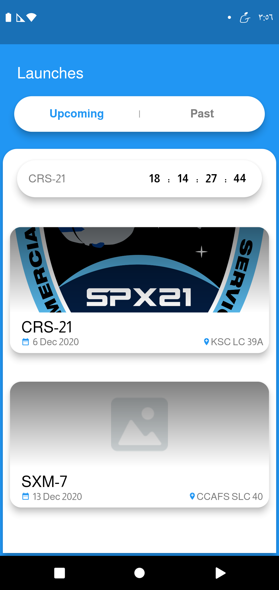

# Spacex Mobile App Guideline

Simple steps you **should follow whenever** you developing  the Mobile App

- [Platform](#platform)
- [Branches](#branches)
- [Screenshots](#screenshots)
- [Install](#install)
- [Issues](#issues)
    - [Available Labels](#available-labels)

## Screenshots


## Screenshots

Upcomming Launchs               |  Past Launch                | Launch Detail         
:-------------------------:|:-------------------------:|:-------------------------:
||||


## Install

```
$ flutter pub get
```
```
$ flutter pub run flutter_launcher_icons:main
```
```
$ flutter pub run flutter_native_splash:create
```
```
$ flutter packages pub run build_runner build --delete-conflicting-outputs
```
```
$ flutter packages pub run build_runner build --delete-conflicting-outputs
```
```
$ flutter run  --dart-define=FLAVOR=development --target lib/main.dart
```
## Platform

Any time you develop the App, Please consider to identify your platform for us. and in some examples we will use the following convention `[platform]-[action]`, Where: 

- `[platform]` will be replaced by `[Android, iOS, etc...]`
- `[action]` will be replaced by any action in different places `[issues, branches, pull requests, etc...]`

## Branches
Every platform must define and use at **least 3 different branches**

- `[platform]-development` Here is the **development environment** and you must push: 
    - **unfinished piece of code**
    - **untested feature or bug fix**
    - **new features** 
    - **Enhancement**
    - after finishing your task you can push to `[platform]-staging` for testing

> Please **Never** push to `[platform]-staging` until you finished your task and tested it by your self in your development environment

- `[platform]-staging` Here is The **testing environment** where you test your code **like it's on production** and you must push:
    - **finished feature or bug fixes**
    - **finished new features** 
    - **finished Enhancements**
    - after testing the new code and take the approve you can push to `[platform]-production` to take application to production

> Please **Never** push to `[platform]-production` until you ensure that there are no bugs in the app.

- `[platform]-production` Here is The **production environment** where your code **is bug ree and working as expected** and you must push:
    - **finished and tested feature or bug fixes**
    - **finished and tested new features** 
    - **finished and tested Enhancements**
    - after pushing the new code you must create a new **release** and push to your **Platform Store** 

## Issues
When working with issues you should follow some steps

1. if you start working on issue please add your `[platform]: in progress` label to selected issue

2. if you push your code to `[platform]-staging` branch after finishing your local test please add your `[platform]: resolved` label to selected issue

> Notice: Following step are in `[platform]-staging` branch and related to testing features
3. when there are someone or even you testing your issue please add your `[platform]: in review` label to selected issue 

4. After testing your issue and there are no errors please **close issue** after leaving a **Comment** that every thing is good then Please push to `[platform]-production` Branch, after Read **Branches** Section to knew which steps you need to push into `[platform]-production` branch, 

5. After testing your issue and there are errors please review it if errors found then repeat steps from `1-4` and please consider **removing labels and assign add it again** and **if issue was closed then open it** and explain your error exactly in comments.

6. After testing your issue and there are errors please review it if errors not found then add your `[platform]: invalid` label and don't close issue until we sure  with explaining in comments that there are no errors if there are no errors please **close the issue**.

### Available Labels
- `[platform]: in progress` for issue that you working on.

- `[platform]: resolved` for issue that are finished.

- `[platform]: in review` for testing issue after finishing it.

- `[platform]: invalid` mark issue as not found and not valid or need more information.
